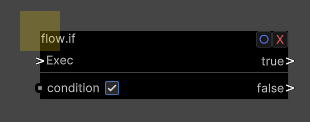
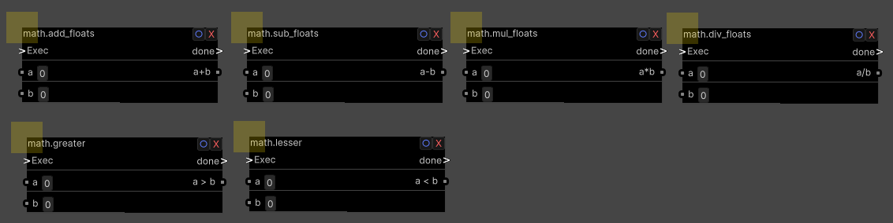
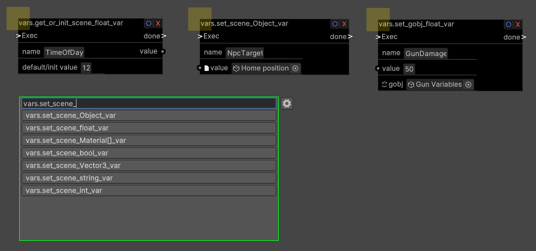
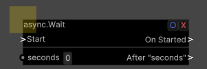
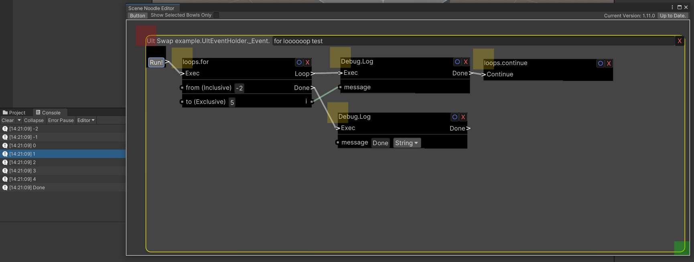

# All Custom Nodes

flow.if

  Lets you do stuff conditionally;  
  If the condition is true It'll run the "true" pin. 
  Otherwise, the "false" pin. 
  

Math Operators

math.add, math.sub, math.mul & math.div manipulate numbers. 
They take two numbers (a, b) and add, subtruct, multiply or divide them. 

math.greater & math.lesser takes two numbers, compare them, and returns a bool (True/False) for use with the flow.if node. 

Variables

  There are many Variable Nodes availiable, each prefixed by "vars." for easy searching. 
  Vars can store: 
- floats (aka decimal numbers like 3.14, .3333, -7.89),  
- ints (aka whole numbers like 5, 10, 300, -2),  
- strings (aka text & words),  
- Vector3s (aka Coordinates, as in X Y Z),  
- bools (true/false), 
- UnityEngine.Objects (This can be anything worldly! Like a nullbody, a gun, the player, a zone, etc...) 
  There are 2 ways Variables are stored: gobj vars, and scene vars. 
   
  <em><strong>Scene vars</strong></em> are publicly accessible by name, and can be used by any ult-event anywhere. 
  Events from spawnables, levels, and avatars can all communicate via scene vars. 
  (Ex: a magic stopwatch that edits the "TimeOfDay" Scene variable, messing with a Day Night cycle world.) 
   
  <em><strong>Gobj vars</strong></em> are private; You have to supply a Gameobject this variable will latch on to, meaning 
  no other mod could mess with it without some extreme ult-event tomfoolery. 
   
   
  (the get_or_init variant of vars allow you to specify a default value.)  
  
  

async.Wait

  This node will delay execution for the specified time. 
  
  

Loops

loops.for, loops.while, loops.continue and loops.break all let you run events over and over again. 
Don't create an infinite loop - it'll freeze unity and bonelab. 
     
The base concept of a "For" and "While" Loop won't be explained here. 
   
A loop's body must always end in either a loops.continue, or a loops.break node. 
This is because "loops.continue" is what's actually responsible for looping, 
While "loops.break" will skip to the "Done" pin and immediately end the loop. 
     
If you don't hit either, the loop wont continue or end, and instead will just die out immediately. 
  
 
(fyi loops.continue and loops.break are compatible with async.wait) 

