# Mechanics
## Noodle Bowls & The Noodled Editor
Noodled-Events is a node-based language that compiles down to Ult-Events.<br>
The Noodled Editor can be accessed by creating a bowl or clicking the NoodledEvents > Noodled Editor button on the menu bar, usually positioned to the right of the Stress Level Zero dropdown.

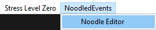

Creating a bowl can be done by creating an Ult Event Holder (or other compatable type), opening its context menu, and clicking the Noodle Bowl button.

One Event Monobehaviour | Multiple Event Monobehaviour
:-: | :-:
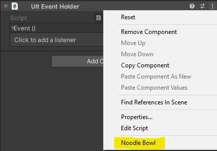 | 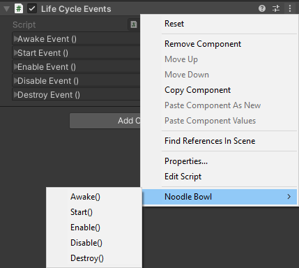


The Noodled Editor consists of 4 sections, the menu bar, the Inspector, the Bowl Selector, and the Graph View.

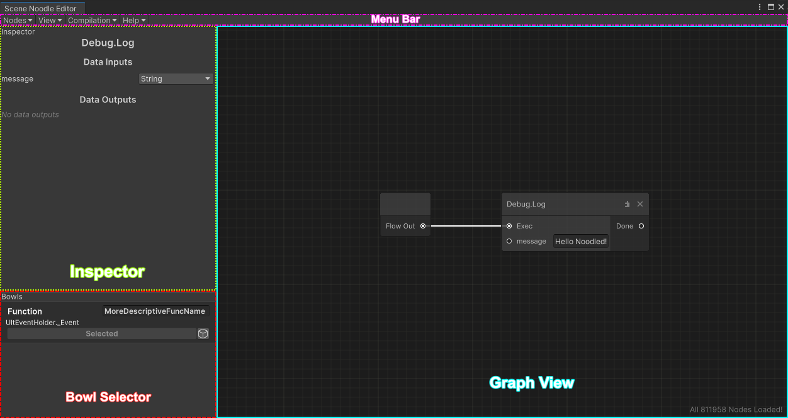

### The Bowl Selector
The Bowl Selector allows you to switch between different bowls within the scene.
Each bowl gets a bowl element, consisting of the following: 
1. The bolded text in the top left is the name of the GameObject the bowl is on.
2. The editable text in the top right is the name of the bowl.
3. The small text below the GameObject name is where on the GameObject the UltEvent targeted by the bowl is. (Component.field)
4. The Select button selects the given bowl, showing its nodes in the graph view.
5. The small button with the GameObject icon highlights the bowl's GameObject when clicked on.

Bowls are organized by placement in the Hierarchy. Bowls parented to root are shown first, top to bottom.

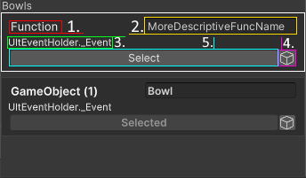

### The Menu Bar
The menu bar within the editor contains options and functions.
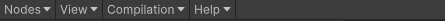
```md
Menu Bar
  ├ Nodes
  |   └ Regenerate Nodes: Regenerates Node Definitions, happens when opening the editor and when recompiling assemblies.
  ├ View
  |   ├ Inspector: Visibility Toggle
  |   ├ Bowl Selector: Visibility Toggle
  |   ├ Grid Background: Visibility Toggle
  |   ├ Selected Bowls Only: When enabled, only shows bowls which are on gameobject currently selected in the Hierarchy.
  |   └ Rebuild View: Rebuilds the Graph View. Good first step for debugging odd issues.
  ├ Compilation
  | ├ Add Debug Logs: Adds debugging logs to methods that use it.
  | └ Use Inline Ultswaps: Toggle for legacy compilation method. Turn off if experiencing issues with functions.
  └ Help
     └ GitHub: Opens holadivinus/NoodledEvents on GitHub
```

### The Graph View
The Graph View is the main part of Noodled-Events
Keybinds:
- F to center the nodes in the middled of the viewport at zoom calculated to show all nodes
- O to align the Bowl In/Out node to the top left at standard zoom
- Right Click to open the context menu
- Space to open the node search bar at cursor position
- Middle Click and drag to pan the view

#### Node Search Bar
When creating a new node, you will mostlikely use the node search bar.
Object method and propery nodes are named as {Class Name}.{Function Name}. Note: Properties in C# are wrappers for function calls that are used like fields in writing, having the names get/set_{Property Name}. Fields get/set nodes are under {Class Name}.getf/setf_{Field name}.
Additionally, you can hover over a given method select button to see it's full path and what assembly it's from.

Methods | Properties | Fields
:-:|:-:|:-:|
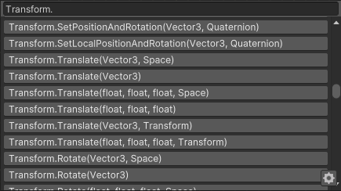 | 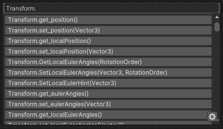 | 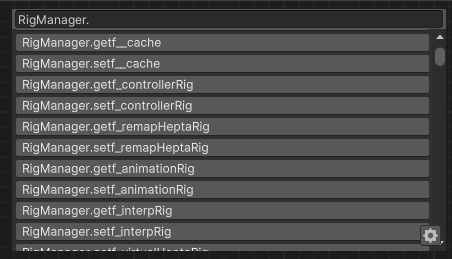

Clicking the  "" icon shows the alternatives menu, which allows you to select from nodes related to the node that the button was clicked on.
Additionally, you can drag in a gameobject from the Hierarchy window and select a component on it, creating a node with no inputs or outputs to select an alternative with the given component as a target.

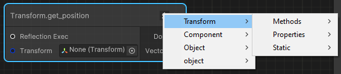
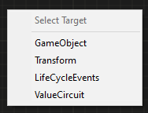
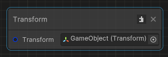

#### Nodes

System.Object parameters on nodes allow you to pick between any of the default Ult Parameters and defaults to None, which needs to be changed by either connecting another node's output or selcting one of the options. Pick Object and leave it blank to use null as the argument.

System.Type parameters on nodes have a string field in which inputting the name of a class will auto fill to the closest class, filling out a fully-qualified name. This generates a Type.GetType call with "case insensitive" and "throw on fail" checked, meaning if the name is not valid, the event will fail.

Noodled-Events also have the ability to call methods on objects that are not directly referenced in the event, such as objects returned from functions. Nodes where this happen are prefixed with "Reflection", making "Reflection Exec".<br>
Note that when the compilation "Inline Ultswapping" is off, direct calls to unity objects in the scene and in assets will also have this prefix despite not being what Noodled-Events considers a reflective call. ^[1]

[^1]; Subject to fixes 

## Functional flow and comp storing
Compilation of nodes starts at the Bowl In/Out node, which is the only node in a new bowl and has 1 pin titled "Flow out". The inspector of this node has the run button, which is used to run the bowl's functionality in editor.

After some custom nodes, compilation of nodes continues in a different event (UltEvent). This is notable as objects returned from calls compiled in a differnt event can not be directly accessed by calls in another event. For this to happen, these return values need to be stored somewhere and then accessed by the requesting event. This happens automatically in Noodled-Events with what is known as the CompStore (Component-based Variable Storage). Supported types (see [Data/CompStoragers Dict](#compstoragers-dict)) are placed in a compstorager and retrieved when needed. Types that are not supported semi-silently cause compilation to fail and print an error message to the console.

## Var Man
Noodled-Events's Constant Varable Manager component, Var Man is a thing mhhm yup yup.
By organizing bowls under a parent, clusters of bowls can create a kind-of psudoclass, normally used in large, shared ult logic resources. When a Var Man component is placed on this parent game object, Constants can be created for use in child bowls. These constants will be baked into the compiled logic of child bowls when compilation occurs.

Note: Nodes with System.Object inputs (eg: Debug.Log) are not compatible.

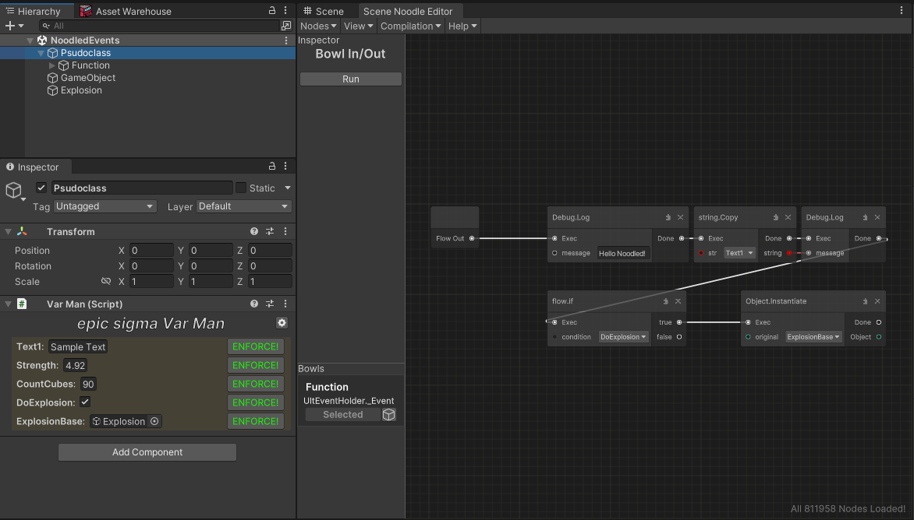

## Custom Nodes

<details>
<summary>flow.if</summary>
  Lets you do stuff conditionally; <br>
  If the condition is true It'll run the "true" pin.<br>
  Otherwise, the "false" pin.<br>
  Branching incurs a compstore due to generating 2 new events for each branch<br>
  If the condition parameter is a constant, Noodled-Events will only compile the corresponding branch, continuing from the event the flow.if was called from without creating a new event, therefore, not encurring a CompStore.<br>

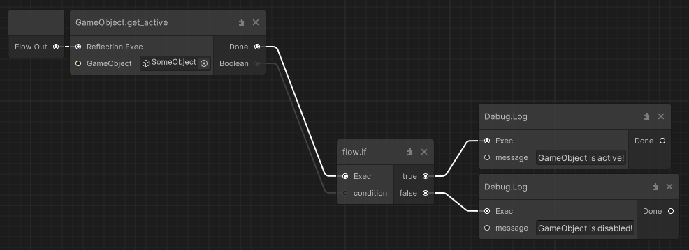
</details>

<details>
<summary>Math Operators</summary>
math.add_floats, math.sub_floats, math.mul_floats & math.div_floats manipulate numbers.<br>
They take two floats (a, b) and add, subtruct, multiply or divide them.<br>

math.greater & math.lesser takes two numbers, compare them, and returns a bool (True/False) for use with the flow.if node.<br>
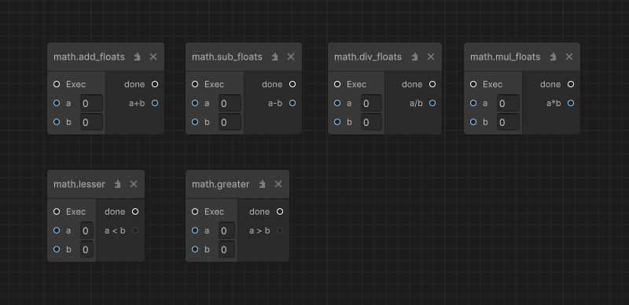
</details>

<details>
<summary>Variables</summary>
  There are many Variable Nodes availiable, each prefixed by "vars." for easy searching.<br>

  To see what types are supported, see [Data/CompStoragers Dict](#compstoragers-dict). <br>
  There are 4 ways Variables are stored: gobj vars, scene vars, saved string vars, and global System.Object vars.<br>

  <em><strong>Scene vars</strong></em> are publicly accessible by name, and can be used by any ult-event anywhere.<br>
  Events from spawnables, levels, and avatars can all communicate via scene vars.<br>
  (Ex: a magic stopwatch that edits the "TimeOfDay" Scene variable, messing with a Day Night cycle world.)<br>
  <br>
  <em><strong>Gobj vars</strong></em> are private; You have to supply a Gameobject this variable will latch on to, meaning<br>
  no other mod could mess with it without some tomfoolery.<br>
  A subset of gobj vars exist called <em><strong>bowl vars</strong></em>. They act the same as gobj vars but do not have a gobj parameter, instead, they create their compstore under the Bowl_generated gobj created when the bowl compiles.<br>

  <em><strong>Saved String vars</strong></em> are used to save and persist strings across game sessions. The (get/set)_saved_string_var nodes save a string to the player's BONELAB level save data dictionary, same as checkpoints and ammo pickups.

  <em><strong>Global System.Object vars</strong></em> are used to store objects that are not in the CompStoragers Dict and/or need to be persisted between level loads.
  <br>

  (the get_or_init variant of vars allow you to specify a default value.) <br>
  
  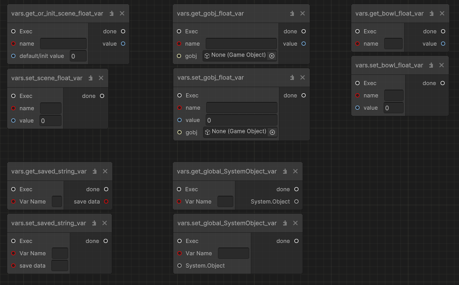
</details>

<details>
<summary>async.Wait</summary>
  This node will delay execution for the specified time.<br>
  Internally, this node uses a DelayedUltEventHolder to delay until next, incuring a compstore.
  Additionally, the "embedded" compile time constant parameter determines whether or not the event will get parented to the scene root before being starting the timer. The reason for this feature is that if the event is embedded and the parent object of the event is disabled, the event will not run due to DelayedUltEventHolder using a <a href = "https://docs.unity3d.com/2021.3/Documentation/ScriptReference/MonoBehaviour.StartCoroutine.html">coroutine</a> to handle delayed activation.
  
  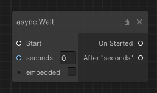
</details>

<details>
<summary>Loops</summary>
loops.for, loops.while, loops.continue and loops.break all let you run events over and over again.<br>
Don't create an infinite loop - it'll freeze unity and bonelab.<br>
    <br>
The base concept of a "For" and "While" Loop won't be explained here.<br>
  <br>
A loop's body must always end in either a loops.continue, or a loops.break node.<br>
This is because "loops.continue" is what's actually responsible for looping,<br>
While "loops.break" will skip to the "Done" pin and immediately end the loop.<br>
    <br>
If you don't hit either, the loop wont continue or end, and instead will just die out immediately.<br>
  
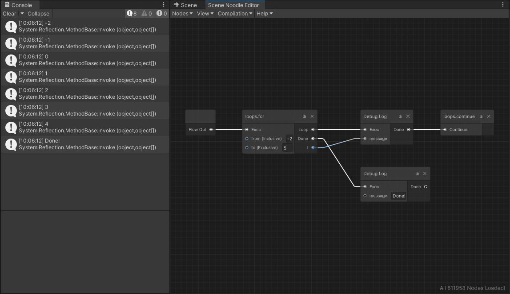<br>
(fyi loops.continue and loops.break are compatible with async.wait)<br>
</details>

<details>
<summary>UltSwapping/Caching</summary>
  Outlined UltSwapping allows you to utilize a direct call to a Unity Object instead of a reflective call for better performance in loops.

  The flow.ult_swap node will run "On Cache" untill a flow.ult_swap_end node reports a found object;<br>
  Then, all future execution will run "Post Cache", with access to the found object.<br>
  Refferences to the found object will be UltSwapped in, so users won't need to perform hefty operations every frame.<br>
  <br>
  
  
</details>

<details>
<summary>Delegates</summary>
The delegates family of nodes allow you to attach the invoke of an ult event to a delegate, such as an action. To create a delegate, you first need to know what you want to attach to, its parameter types, and where it is. For this example, we will use the Action&lt;Collision, float&gt; OnSignificantCollision on the ImpactSFX script.<br>

After the On Created pin, you should follow these steps to add your delegate onto another.

1. Create the delegate with the parameters needed by the target event.<br>
2. Get the delegate object you want to attach your new delegate to<br>
3. Use Delegates.Combine to combine the two delegates.<br>
4. Set the new delegate object where you got the target from.<br>
5. Optional: store the string returned by the "DelegateID" pin. Using this string in the delegates.Fetch node allows you to retrieve the delegate in a later event, allowing you to remove it from a target if need be.

After doing this, whatever is after "On Triggered" will run when the delegate is invoked!

<b>NOTICE: Objects that derive frome ValueType (ValueTypes) will crash the game if attempted to access.</b>

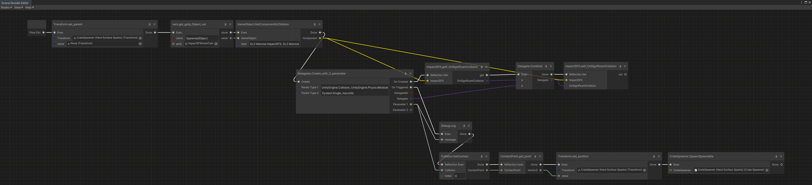
<sub>right-click and open in new tab to look closer!</sub>

</details>

## Data
### CompStoragers Dict
|          Type         |
| :-------------------: |
|   UnityEngine.Object  |
|         float         |
|       Material[]      |
|          bool         |
|         Vector3       |
|         string        |
|          int          |
|        Vector2        |